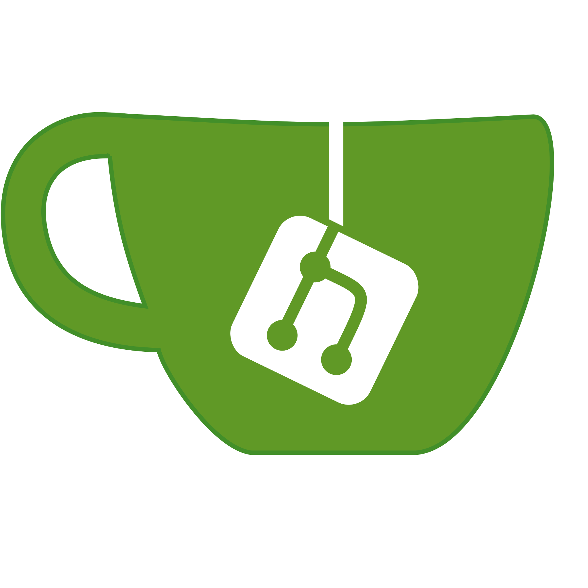
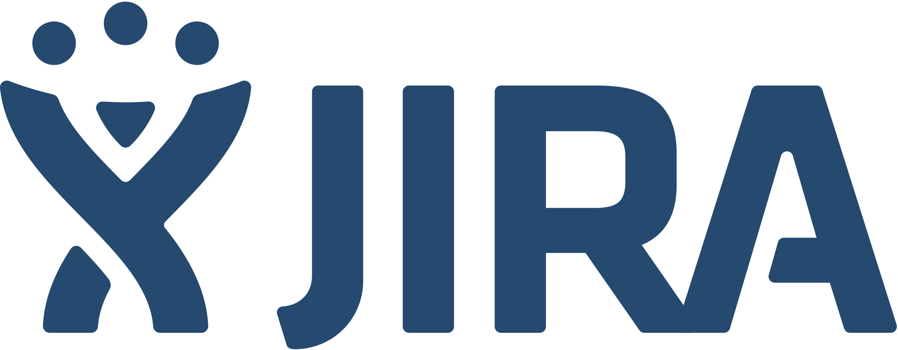

### Hi there 👋
## I'm Piotr Bach, a Software Engineer but from time to time also an Automated Tester.

### 🔭 I’m currently working on:
         

### 🌱 I’m currently learning:
  

### :skull: Previously worked with:
        
   
   
 
 

### 🤔 Next phase to learn technologies:
       

### :computer: Dev Tools:
         

### :sunglasses: Free time:
 

<!--
**pbach/pbach** is a ✨ _special_ ✨ repository because its `README.md` (this file) appears on your GitHub profile.

Here are some ideas to get you started:

- 🔭 I’m currently working on ...
- 🌱 I’m currently learning ...
- 👯 I’m looking to collaborate on ...
- 🤔 I’m looking for help with ...
- 💬 Ask me about ...
- 📫 How to reach me: ...
- 😄 Pronouns: ...
- ⚡ Fun fact: ...
-->
